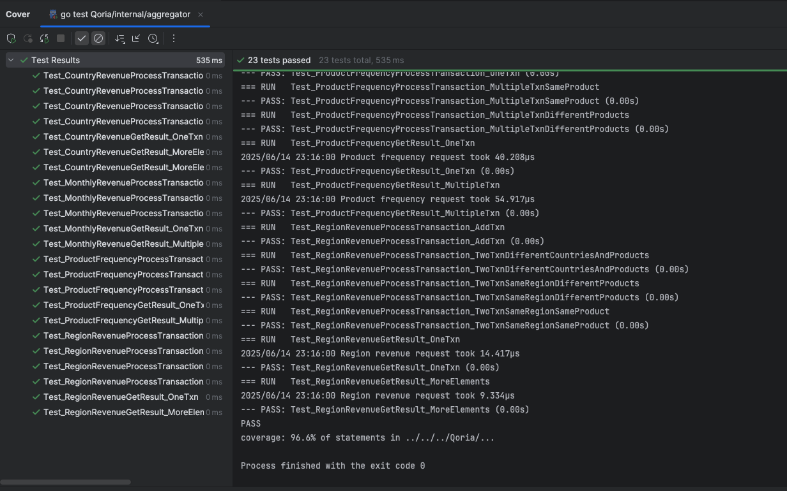

# **Business Insights Dashboard**

* Clone the repository.
* Execute `go mod tidy`
* Place the `GO_test_5m.csv` file into the `/data` directory. 
* A Python script `split_csv.py` is provided to split the CSV file into multiple files. 
* Open terminal and execute `python3 external/split_csv.py`
* This will generate multiple smaller CSV files in the `/data/split/` directory. 
* Go to root directory and execute `go run cmd/main.go` to start the service. 
* Open the browser and go to `http://localhost:8080/` to load the dashboard.

* Unit tests are added to test the internal functionality.
* Unit test count is 23 and current unit test coverage is 96.6%. 
* Refer 

